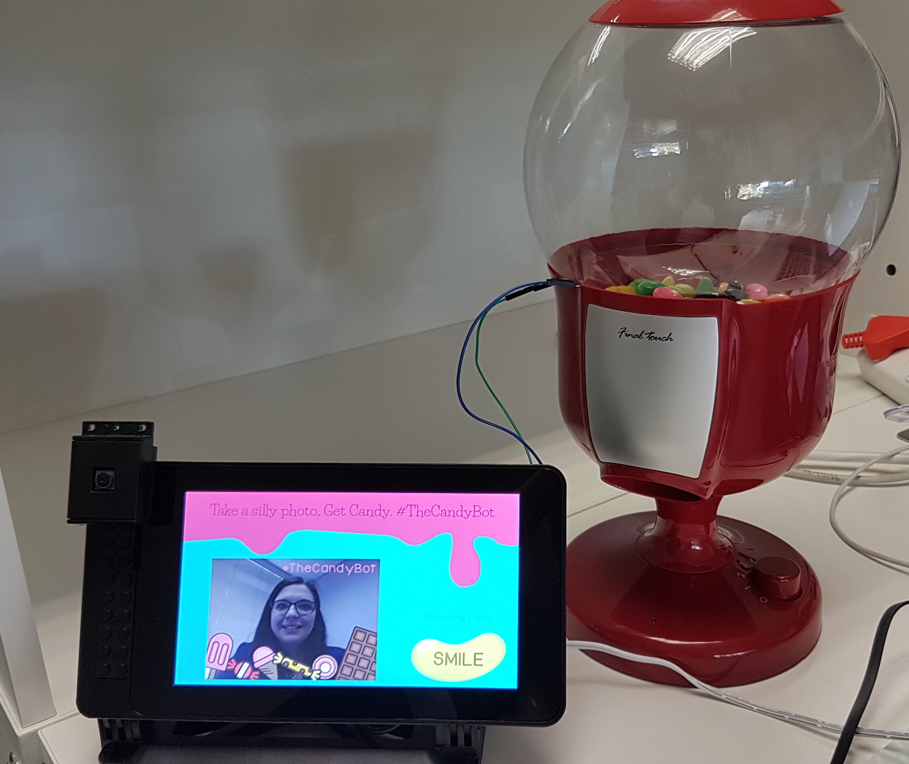
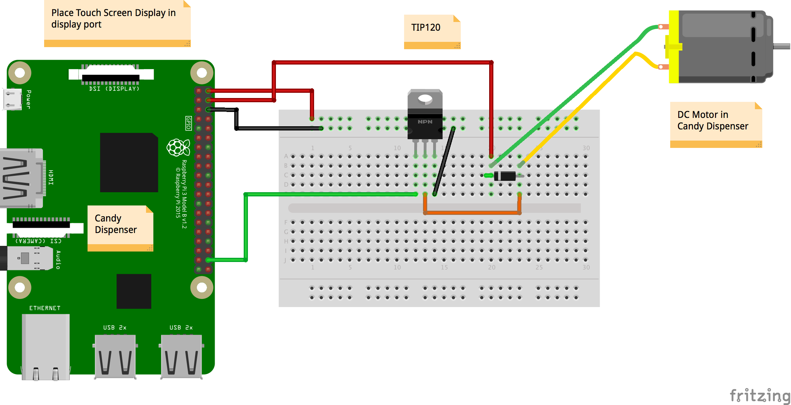

# Android Things Candy Bot

A candy dispenser that waits for you to smile then dispenses candy and posts pictures to [@TheCandyBot](https://twitter.com/TheCandyBot) on Twitter.


Largely inspired by the [AI Candy dispenser](https://github.com/alvarowolfx/ai-candy-dispenser)

# Technology used:
- Android Things
- Google Vision API 
- Twitter SDK


# Pre-requisites:
- Android Things compatible board (Raspberry Pi 3 or NXP Pico IMX7D)
- Android Things compatible camera (for example, the Raspberry Pi 3 camera module)
- Android Studio 2.2+
- Camera
- Android Things Compatible Touch Screen 
- 1 Breadboard
- 1 Electric Candy Dispenser
- 1 TIP120 Transistor (NPN)
- Jumper wires
- 1 Diode

# Schematics




# Setup and Build 
- Create `twitter.properties` file in top level folder. Inside it include the following:
```gradle
TWITTER_API_TOKEN="your_token"
TWITTER_API_SECRET="your_secret"
TWITTER_USER_ID=userid
TWITTER_USERNAME="TheCandyBot"
TWITTER_CONSUMER_KEY="consumer_key"
TWITTER_CONSUMER_SECRET="consumer_secret"
```
You can get all of these by signing up for Twitter API here - https://dev.twitter.com/.

Run the application on your Android Things device. 
Press the "Smile" button and then watch as your candy gets dispensed and delivered to you.


